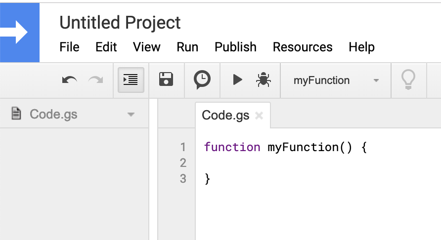

# forms-email
This is a script to send the respondent of a google form an email from us when they submit it.

This was originally made to be used for ODPhi's [César Chávez Day of Service](https://www.nuodphi.com/ceacutesar-chaacutevez-day-of-service.html) in 2019, but it can be used for any form. There are plenty of things this could be used for. To name a few:

- Food fundraisers
- Event signups
- Alumni events (include in the email a link to save the event in their calendar)

A good example would be to send a confirmation email after someone preorders food from ODPhi. We could send them an email back including what they ordered, how much they need to venmo, where they can pick it up, and at what time.

## Set up

- Create a new form with the **email that you want to send emails from**.

- Click on the settings button and check the box that says "Collect email addresses".

- Click on the 3 dots in the upper righthand corner and then click on "script editor". This should open up a new tab.

  - If insted you get an error that says "Sorry, unable to open the file at this time," then log out of all other google accounts in chrome. Only be logged in to the account from which you want to send the email response in the form.

  You should see a page that looks something like this, where you can insert code:

  

  

- Give the Project a name where it currrently says "Untitled Project". This can be anything, but make it unique to this form script so it's easy to tell what it is if someone ever opens the google developer account for this email.

- Open [`Code.js`](./Code.js) in this repository and copy and paste the code into `Code.gs` in the new window that opened, replacing the code that was already there. Save the code by pressing ⌘S or clicking File / Save

- Click on Edit / Current Project's Triggers. This should open up a new tab.

  - In this new tab, click on "+ Add Trigger" in the bottom righthand corner and a new popup should appear. In this popup:
    - Make sure that "Choose which function to run" says "sendConfirmationEmail". If it does not, make sure that you saved your code after you copied and pasted it in. If you are sure you did that, then try refreshing the page.
    - Under "Select Event Type", change from "On open" to "On form submit"
    - Click "Save"

- Go back to the window with your project and your code. Click on Resources / Advanced GoogleServices (it may take a second for it to load). This should open a new popup. 

  - Scroll down until you see Gmail API. Turn the toggle in that row from "off" to "on"
  - A mini popup should appear in yellow at the bottom of this popup. Click on the link to "Google Cloud Platform API Dashboard". This should open a new tab, from here:
    - Click on "+ ENABLE APIS AND SERVICES"
    - In the search for where it says "Search for APIs & Services" type in "Gmail" and hit enter.
    - Click on "Gmail API"
    - Click on the box that says "Enable"

- Your done! If you want to change what the email says

## Customization

