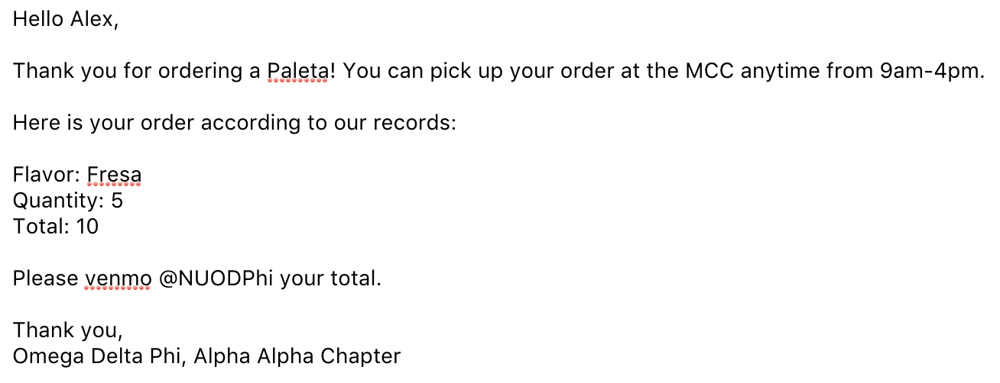
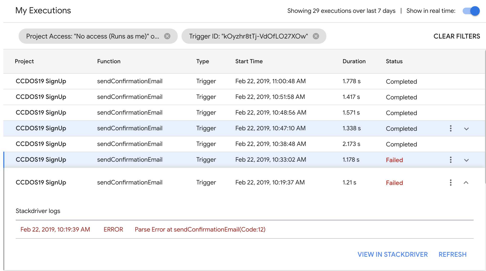

# forms-email
This is a script to send the respondent of a google form an email from us when they submit it. If you follow the steps below, this script will be run whenever someone submits the form, using the information they provided us with in the code.

This was originally made to be used for NU ODPhi's [César Chávez Day of Service](https://www.nuodphi.com/ceacutesar-chaacutevez-day-of-service.html) in 2019, but it can be used for any form. There are plenty of things this could be used for. To name a few:

- Food fundraisers
- Event signups
- Alumni events (include in the email a link to save the event in their calendar)

A good example would be to send a confirmation email after someone preorders food from ODPhi. We could send them an email back including what they ordered, how much they need to venmo, where they can pick it up, and at what time.


## Set up

- Create a new form with the **email that you want to send emails from**.

- Click on the settings button and check the box that says "Collect email addresses".

- Click on the 3 dots in the upper righthand corner and then click on "script editor". This should open up a new tab.

  - If insted you get an error that says "Sorry, unable to open the file at this time," then log out of all other google accounts in chrome. Only be logged in to the account from which you want to send the email response after someone fills out the form.

  You should see a page that looks something like this, where you can insert code:

  

  

- Give the Project a name where it currrently says "Untitled Project". This can be anything, but make it unique to this form script so it's easy to tell what it is if someone ever opens the google developer account for this email.

- Open [`Code.js`](./Code.js) in this repository and copy and paste the code into `Code.gs` in the new window that opened, replacing the code that was already there. Save the code by pressing ⌘S or clicking File / Save

- Click on Edit / Current Project's Triggers. This should open up a new tab.

  - In this new tab, click on "+ Add Trigger" in the bottom righthand corner and a new popup should appear. In this popup:
    - Make sure that "Choose which function to run" says "sendConfirmationEmail". If it does not, make sure that you saved your code after you copied and pasted it in. If you are sure you did that, then try refreshing the page.
    - Under "Select Event Type", change from "On open" to "On form submit"
    - Click "Save"

- Go back to the window with your project and your code. Click on Resources / Advanced GoogleServices (it may take a second for it to load). This should open a new popup. 

  - Scroll down until you see Gmail API. Turn the toggle in that row from "off" to "on"
  - A mini popup should appear in yellow at the bottom of this popup. Click on the link to "Google Cloud Platform API Dashboard". This should open a new tab, from here:
    - Click on "+ ENABLE APIS AND SERVICES"
    - In the search for where it says "Search for APIs & Services" type in "Gmail" and hit enter.
    - Click on "Gmail API"
    - Click on the box that says "Enable"

- Your done! To change what the email says look below at the Customization section.


## Customization

**NOTE: This script inserts the respondent's name by taking their name from the google form. If you want to include this functionality, make sure that the second question after collecting emails is asking for their first name. For more information, look at the Getting User's Responses from the Form**

### Change the Subject and Body of the Email

***Note**: If you want to change the subject of body to include any responses from the form then look below at **Getting User's Responses from the Form**.

In `Code.js` you will see the following code in line 16:

```javascript
GmailApp.sendEmail(address, subject, message);
```

This is the piece of code that tells Gmail to send the email from the account that made the google form. It sends it to the email address `address`, with the subject `subject`, and email body `message`.

It's probably best to not mess with the address, or 

#### Subject

The `subject` variable that we pass to `GmailApp.sendEmail()` is made in line 5:

```javascript
var subject = "César Chávez Day of Service"
```

Change the subject to be whatever you want by changing what's inside the double quotes

#### Message


### Getting User's Responses from the Form

As of right now, the only thing personalized in the email is the respondent's name. The way we get the name is on lines 2 and 3 of the code when we say :

```javascript
var items = e.response.getItemResponses();
var name = items[0].getResponse();
```

The `items` variable is a list of item objects that contains all of the questions and responses from the form. In each item object, we can get the title (what you asked) and the response (what they responded)

```javascript
// What we asked
var nthTitle = items[n].getItem().getTitle();

// What they responded
var nthResponse = Items[n].getResponse();
```

Google doesn't count the email as the first item in the form when we turn on "Collect email addresses". So, the first item in the list of items will be the question directly after the question collecting emails at the top. Remember that indexes start from 0, so the first item after email will be the 0th item, and the one after that the 1st item. Assuming that the respondent's first name is the first thing we ask for after the email, the following code can be left as it is in order to get the respondent's first name:

```javascript
var name = items[0].getResponse();
```

As you can see in line 7, the response from the item object is a string so we can concatonate the responses onto the message that we are building:

```javascript
var greeting = "Hello ".concat(name, ",");
```


## Example

Let say we had a form that asked the following questions and recieved the following responses:

- Email - alexmacedo2020@u.northwestern.edu
- First Name - Alex
- Last Name - Macedo
- Paleta Flavor - Fresa
- Quantity - 5

The following code would send alexmacedo2020@u.northwestern.edu an email when Alex submits the form:

```javascript
function sendConfirmationEmail(e) {
  // get info from the form
  var items = e.response.getItemResponses();
  var address = e.response.getRespondentEmail();
  
  // get responses
  var name = items[0].getResponse();
  var flavor = items[2].getResponse();
  var quantity = items[3].getResponse();
    
  // calculate total
  var price = 2;
  var total = price * quantity;
  
  // construct message
  var greeting = "Hello ".concat(name, ",");
  var thankyou = "\n\nThank you for ordering a Paleta! ";
  var pickup = "You can pick up your order at the MCC anytime from 9am-4pm.";
  var confirmation = "\n\nHere is your order according to our records:";
  var order = "\n\nFlavor: ".concat(flavor, "\nQuantity: ", quantity, "\nTotal: ", total);
  var venmo = "\n\nPlease venmo @NUODPhi your total.";
  var signature = "\n\nThank you, \nOmega Delta Phi, Alpha Alpha Chapter";
  var message = greeting.concat(thankyou, pickup, confirmation, order, venmo, signature);
  
  // construct subject
  var subject = "Paleta Order!"
  
  // send email
  GmailApp.sendEmail(address, subject, message);
}
```

The email would look like this:




## Testing

To test it out, just start filling out the form as if you were a user! Make sure you've saved your code before you submit the form otherwise it won't use the new code you have. You should be able to see what your email looks like as an email if you input your personal email address to the form and send yourself and email with this code.

If you don't receive an email, there's probably something wrong somewhere in your code and the javascript won't compile, meaning it doesn't understand what you wrote. To solve errors like this you can do one of two things:

#### Logging

```javascript
var items = e.response.getItemResponses();
var name = items[0].getResponse();
var address = e.response.getRespondentEmail();
Logger.log("FIRSTNAME = %s, ADDRESS = %s", name, address);
```


#### Trigger Execution Errors




## Questions?

If you have any questions feel free to reach out to me, [Gabe](www.github.com/rojaswestall)! As a part of Chi Line and a CS Major, I will be more than willing to help with anything tech related I did while I was an active in ODPhi. Especially if you want to try something new 🙂 Send me a text or send me an email!